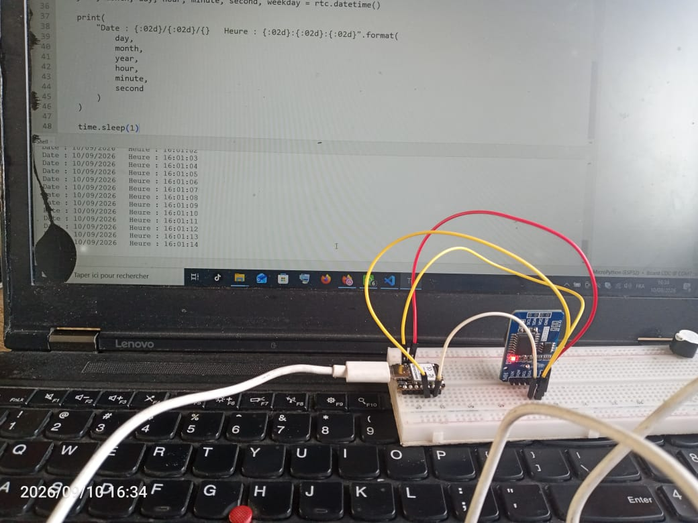
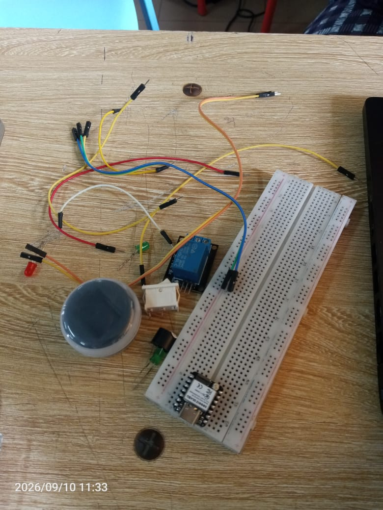

# Journal — 10 septembre 2026

**Rédigé par : OURO-WASSARA Chérif**

## Fait aujourd'hui

- Poursuite du travail sur le **projet de sonnerie automatique solaire**.
- Test du **XIAO ESP32-S3 avec le DS3231** dans **Thonny**.
- Test de l'**impression 3D du boîtier** du projet.

## Appris

- Mise en œuvre du **DS3231 avec le XIAO ESP32-S3**.
- Tests et programmation du XIAO ESP32-S3 avec **Thonny**.
- Vérification de la conception du **boîtier imprimé en 3D**.

 

## Raté, puis corrigé

- des diffucultés au début mais solution trouvés.

## Décidé

- Poursuivre le développement de l'interface de programmation de la sonnerie.

## À faire demain

- Développer une **interface en mode Access Point (AP)**.
- Permettre de **programmer les heures de sonnerie** à partir de cette interface.