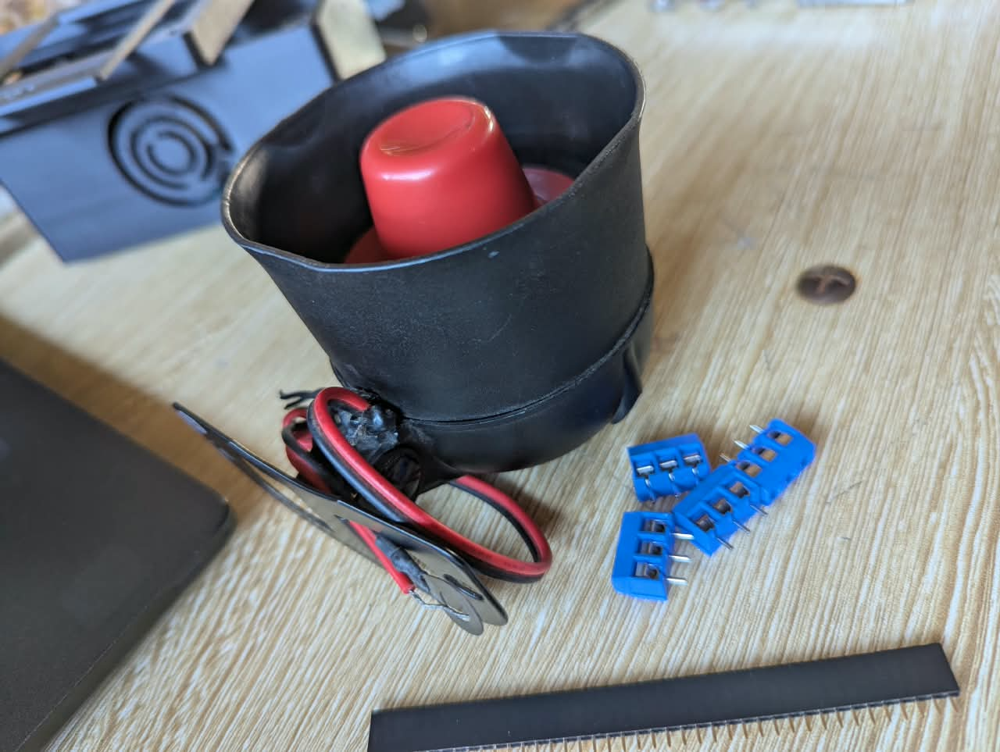

# Journal — vendredi 11 septembre 2026 (rédigé par : OURO-WASSARA Chérif)

## Fait aujourd'hui

### 1. Travail en groupe — Développement de la page Web du projet P083

Le travail du groupe a été organisé autour de deux objectifs principaux.

#### Objectif 1 — Création de la page Web

* Travail en groupe sur la **création de l’interface Web** du projet **P083 — Sonnerie autonome à énergie solaire**.
* Conception de la première version de la page Web permettant d’interagir avec le système.
* Visualisation et test de la page Web sur **téléphone et ordinateur**.
* **Résultat : objectif atteint.**
* La page Web a été créée avec succès.


**Résultat : objectif atteint avec succès.**

#### Objectif 2 — Affichage de l’heure du DS3231 sur la page Web

* Mise en place de la communication entre le **XIAO ESP32-S3**, le programme **MicroPython** et l’interface Web.
* Le fonctionnement mis en place suit la chaîne suivante :

```text
Branchement du XIAO
        ↓
MicroPython démarre
        ↓
main.py s'exécute automatiquement
        ↓
Wi-Fi P083_SONNERIE créé
        ↓
Serveur Web démarré
        ↓
192.168.4.1
        ↓
Interface Web P083
```

* Cette architecture permet au **XIAO ESP32-S3** de créer son propre réseau Wi-Fi et de rendre accessible l’interface Web à l’adresse **192.168.4.1**.


**Résultat :** mise en place de l’architecture permettant d’accéder à l’interface Web du projet à partir du réseau Wi-Fi créé par le XIAO ESP32-S3.

### 2. Réception de nouveau matériel et debut de la réalisation du circuit dans KiCard 

* Réception de nouveau matériel destiné aux travaux pratiques et au développement du projet P083.
* Le matériel reçu est destiné à poursuivre les travaux de conception, de câblage et de prototypage du projet.



## Appris

* J’ai appris à mettre en place une première **interface Web** destinée au projet P083.
* J’ai compris le principe de fonctionnement d’un **serveur Web embarqué sur le XIAO ESP32-S3** avec MicroPython.
* J’ai compris que le fichier `main.py` peut être exécuté automatiquement au démarrage de la carte.
* J’ai compris le principe de création d’un réseau Wi-Fi local nommé **P083_SONNERIE**.
* J’ai appris que l’interface Web peut être accessible localement à l’adresse **192.168.4.1**.
* J’ai compris que le **DS3231** fournit l’heure au système et que cette information doit être intégrée à l’interface Web.
* J’ai également vérifié l’affichage de l’interface Web sur **téléphone et ordinateur**.

## Raté, puis corrigé

* La mise en place de l’interface Web et de la communication avec le XIAO ESP32-S3 a nécessité plusieurs vérifications afin d’obtenir la chaîne de fonctionnement souhaitée.
* → **Cause :** intégration de plusieurs éléments : MicroPython, `main.py`, Wi-Fi, serveur Web et interface utilisateur.
* → **Correction :** vérification progressive du démarrage du programme, de la création du réseau Wi-Fi et de l’accès à l’interface Web.
* → **Résultat :** la page Web a été créée et l’architecture d’accès local au système a été mise en place avec succès.

## Décidé

* Poursuivre le développement de l’interface Web du projet **P083**.
* Continuer l’intégration du **DS3231** afin d’afficher son heure directement sur la page Web.
* Poursuivre la réalisation du circuit électronique dans **KiCad**.
* Commencer la configuration de l’**écran TFT IPS à communication SPI**.
* Tester progressivement les différentes fonctions de l’interface avec le matériel disponible.

## À faire demain

* Poursuivre la réalisation du **circuit électronique dans KiCad**.
* Configurer l’**écran TFT IPS SPI**.
* Continuer l’intégration des différents éléments du projet **P083 — Sonnerie autonome à énergie solaire**.
