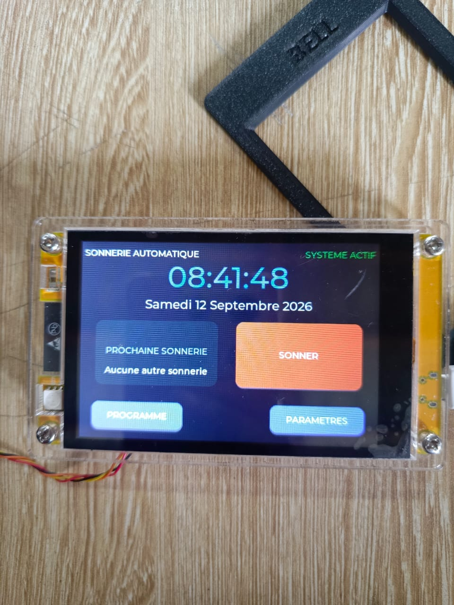

# Journal — samedi 12 septembre 2026 (rédigé par : OURO-WASSARA Chérif)

## Fait aujourd'hui

### 1. Travail en groupe — Optimisation de l’écran d’affichage

Le travail du groupe a été organisé autour de l’amélioration de l’interface d’affichage du projet **P083 — Sonnerie autonome à énergie solaire**.

* Travail sur la **page d’accueil** de l’interface.
* Amélioration du **visuel et de la présentation** de l’écran d’affichage.
* Réflexion sur l’organisation des informations qui seront affichées à l’utilisateur.

### 2. Approfondissement de KiCad et conception du circuit

* Suivi de plusieurs **tutoriels** afin de mieux maîtriser le logiciel **KiCad**.
* Réalisation de plusieurs circuits électroniques dans KiCad afin de renforcer la pratique.
* Poursuite de la conception du circuit électronique du projet **P083**.
* Discussion au sein du groupe sur un **éventuel changement de certains composants**, dans le cas où les composants initialement prévus ne seraient pas disponibles.
* Réflexion sur la nécessité de conserver les fonctionnalités du projet tout en utilisant uniquement les composants réellement disponibles.

## Appris

* J’ai appris à améliorer l’organisation et le visuel d’une **interface d’affichage** destinée au projet.
* J’ai renforcé ma maîtrise de **KiCad** à travers la réalisation de plusieurs circuits.
* J’ai compris l’importance de vérifier la **disponibilité réelle des composants** avant de finaliser la conception d’un circuit.
* J’ai compris qu’un changement de composant doit être étudié en fonction de sa **fonction dans le circuit** et de sa compatibilité avec les autres éléments.

## Raté, puis corrigé

* La disponibilité des composants nécessaires au projet peut nécessiter une adaptation de la conception initiale.
* → **Cause :** certains composants prévus pourraient ne pas être disponibles.
* → **Correction envisagée :** rechercher des composants alternatifs pouvant assurer les mêmes fonctions, sans modifier inutilement l’architecture du projet.
* → **Résultat :** le groupe a engagé une réflexion sur les éventuelles substitutions avant de finaliser le circuit.

## Décidé

* Continuer l’optimisation de la **page d’accueil et du visuel de l’écran d’affichage**.
* Poursuivre la pratique de **KiCad** afin de maîtriser davantage la conception des circuits.
* Vérifier la disponibilité des composants avant de finaliser la carte électronique.
* En cas d’indisponibilité, choisir uniquement des composants alternatifs **compatibles avec les fonctions prévues du projet P083**.

## À faire demain

* Poursuivre la conception du circuit électronique avec **KiCad**.
* Continuer l’amélioration de l’interface d’affichage.
* Vérifier les composants disponibles pour le projet.
* Poursuivre l’intégration des différents éléments du **P083 — Sonnerie autonome à énergie solaire**.